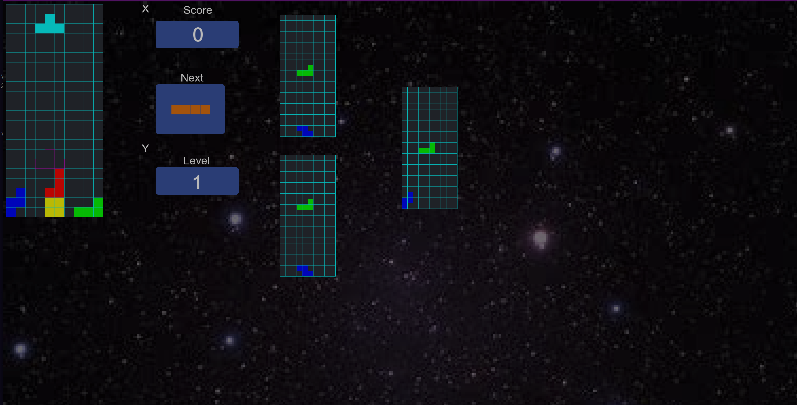

# Tetris Multiplayer

Tetris Multiplayer est une version du jeu classique Tetris, développée en C++ avec l'utilisation de la bibliothèque SFML, ajoutant la fonctionnalité de jeu en ligne sur un réseau local entre amis.

## Description

Ce projet est une adaptation du célèbre jeu Tetris, offrant une expérience multijoueur où les joueurs peuvent compétitionner les uns contre les autres sur un réseau local. Il propose toutes les fonctionnalités classiques du Tetris, telles que le défilement et la rotation des pièces, la gestion des lignes, et bien plus encore, tout en ajoutant une dimension sociale en permettant aux joueurs de s'affronter en temps réel.

## Installation

Pour installer et exécuter le jeu, suivez les étapes suivantes :
1. Clonez ce dépôt sur votre machine locale.
2. Ouvrez le projet en Visual Studio
3. compilez le code en mode realease 

## Utilisation

Une fois le jeu lancé, vous avez deux options de jeu :

- **Solo (Joueur unique)**:
  - Choisissez l'option "Solo" ou "SinglePlayer" dans le menu principal pour jouer en solo. Affrontez le défi du Tetris seul et essayez d'obtenir le meilleur score.

- **Multijoueur**:
  - Sélectionnez l'option "Join Game" dans le menu principal pour rejoindre une partie en ligne avec vos amis sur le même réseau local.
  - Ou choisissez "Host Game" pour créer une nouvelle partie en tant qu'hôte.
  - Le joueur qui héberge la partie est désigné comme le "Host". Seul le Host peut démarrer la partie et la terminer.
  - Les autres joueurs qui se connectent au Host participent à la partie en cours.

## Contributions

Les contributions sont les bienvenues ! Si vous souhaitez contribuer à ce projet, veuillez ouvrir une issue pour discuter des changements que vous souhaitez apporter, ou soumettre directement une pull request.

